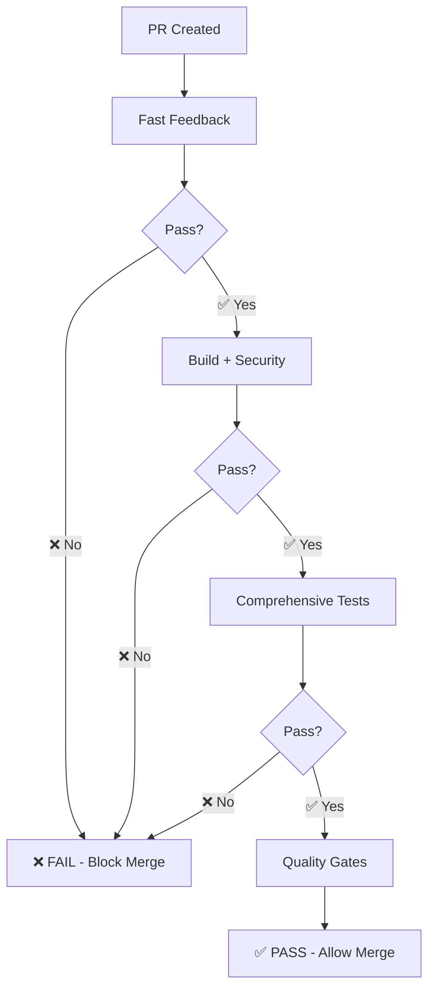

# Branch Protection Configuration

## Overview

The project uses a single **Quality Gates** check as the required status check for branch protection. This simplifies configuration while ensuring comprehensive quality validation.

## Required Status Check

### GitHub Branch Protection Settings

**Repository Settings → Branches → Branch protection rules for `main`:**

```yaml
Required status checks:
  - quality-gates # Single required check

Additional settings: ✅ Require status checks to pass before merging
  ✅ Require branches to be up to date before merging
  ✅ Require pull request reviews before merging (recommended)
  ✅ Dismiss stale PR approvals when new commits are pushed
  ❌ Allow bypass of protections (keep disabled)
```

## Quality Gates Coverage

The `quality-gates` job validates ALL critical checks:

### **✅ Blocking Checks (Must Pass)**

- **Type Checking** - TypeScript compilation (`tsc --noEmit`)
- **Linting** - Code quality (`eslint` with 100 warning max)
- **Unit Tests** - Full test suite (`jest`)
- **Production Build** - Build verification (`npm run build`)
- **Build Artifacts** - PWA assets validation
- **Security Audit** - Vulnerability scan (`npm audit`)
- **License Compliance** - License validation
- **Test Coverage** - Coverage reporting (`jest --coverage`)
- **E2E Tests** - End-to-end testing (`playwright`)
- **Commit Messages** - Conventional commit validation (PRs only)

### **Execution Flow**



## Benefits

### **Developer Experience**

- ✅ **Single status check** to monitor
- ✅ **Clear pass/fail** indication
- ✅ **Detailed failure reasons** in quality-gates job
- ✅ **Fast feedback** on basic issues (~60 seconds)

### **Maintainer Benefits**

- ✅ **Simple configuration** - one rule to manage
- ✅ **Comprehensive coverage** - no gaps in validation
- ✅ **Fail-fast execution** - expensive tests skip if basics fail
- ✅ **Consistent standards** - same rules for all PRs

## Configuration Commands

### **Set up branch protection via GitHub CLI:**

```bash
gh api repos/:owner/:repo/branches/main/protection \
  --method PUT \
  --field required_status_checks='{"strict":true,"contexts":["quality-gates"]}' \
  --field enforce_admins=true \
  --field required_pull_request_reviews='{"required_approving_review_count":1,"dismiss_stale_reviews":true}' \
  --field restrictions=null
```

### **Verify current settings:**

```bash
gh api repos/:owner/:repo/branches/main/protection
```

## Migration Notes

### **Old Configuration (Removed)**

- Multiple required checks: `pr-checks`, `conventional-commits`, `pr-size-check`
- Redundant validations between `ci.yml` and `pr.yml`
- Complex rule management

### **New Configuration (Current)**

- Single required check: `quality-gates`
- Consolidated validation in one workflow
- Simplified rule management

## Troubleshooting

### **Quality Gates Failed - How to Debug**

1. **Click on failed quality-gates check** in PR
2. **Review the job output** - it shows which specific check failed:
   ```
   ❌ Fast feedback failed - Type checking, linting, or unit tests failed
   ❌ Build failed - Production build or artifact verification failed
   ❌ Security checks failed - Audit or license compliance failed
   ❌ Comprehensive tests failed - Coverage or E2E tests failed
   ❌ PR validation failed - Commit message validation failed
   ```
3. **Navigate to the specific failed job** for detailed logs
4. **Fix the issue** and push new commits to re-trigger checks

### **Emergency Bypass**

In rare cases where branch protection needs to be bypassed:

1. Repository admin can temporarily disable branch protection
2. Merge the critical fix
3. Immediately re-enable branch protection
4. **Document the bypass** in PR comments with justification

## Best Practices

- **Keep commits focused** - smaller changes pass quality gates faster
- **Run checks locally** before pushing:
  ```bash
  npm run type-check && npm run lint && npm test && npm run build
  ```
- **Fix issues early** - fast feedback checks fail in ~60 seconds
- **Monitor E2E tests** - they run last and take ~5 minutes
- **Use conventional commits** - ensures PR validation passes
